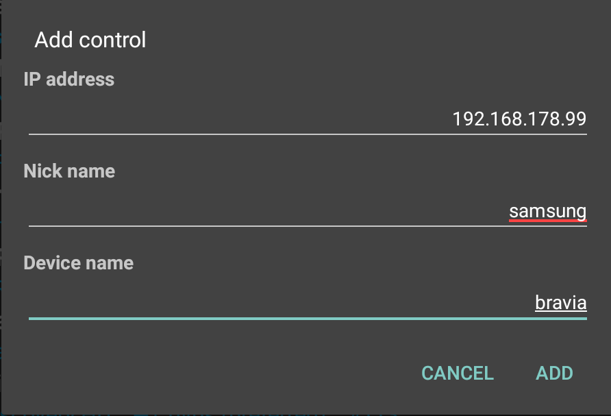

Sony TV Switch
===================================

Easy to use app for searching and switching programs of a Sony TV.

**Main features**
- Works for many smart Sony TVs with network connection (model year ~2013 to ???)
- Controls the Sony TV from your Android device via network (Wifi)
- Lists the TV programs from the TV for easy switching
- As&nbsp;<a href="https://play.google.com/store/apps/details?id=org.tvbrowser.tvbrowser.play">TV Browser</a> plugin: Switch to a TV program directly from the program guide (EPG)

#### Screens

##### Add control dialog
{::options parse_block_html="true" /}

{::options parse_block_html="true" /}

- Provide basic setting for your new control
- You can either enter IP address or host name

{::options parse_block_html="true" /}

