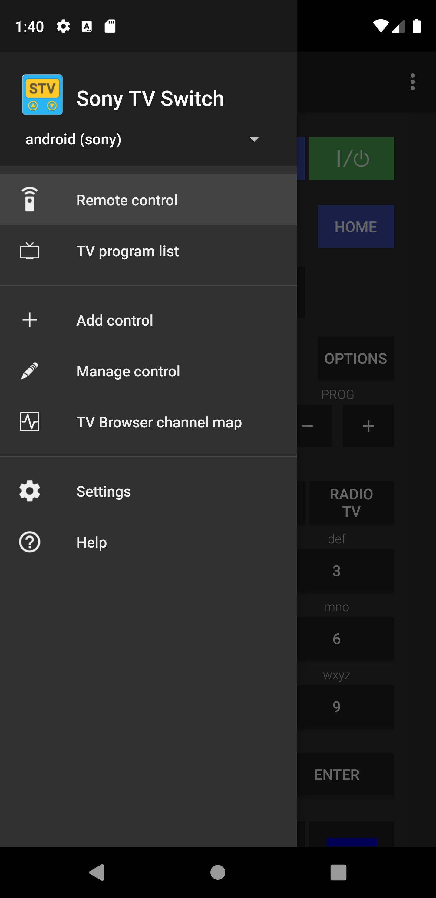
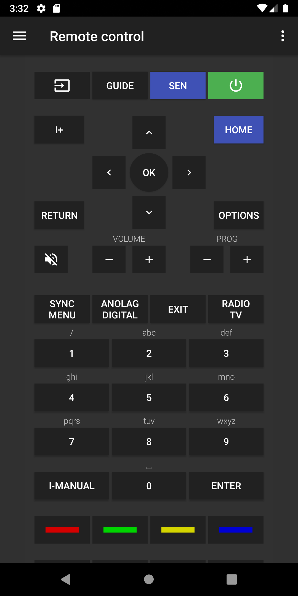
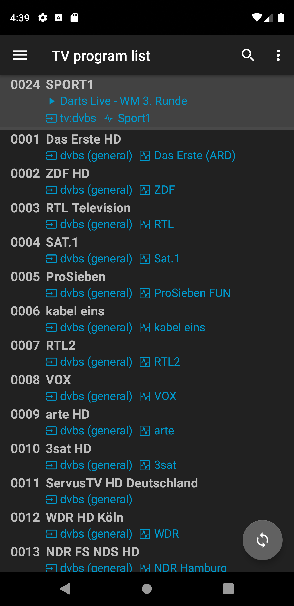
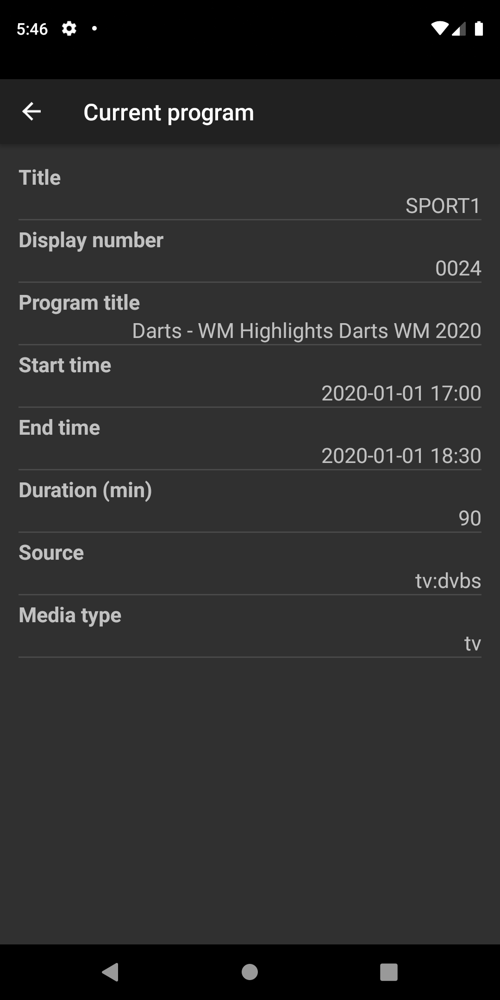
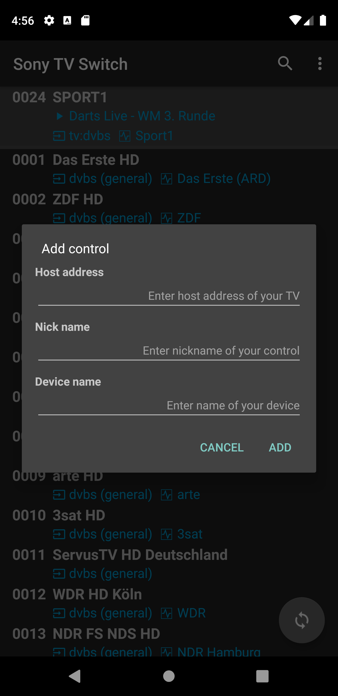
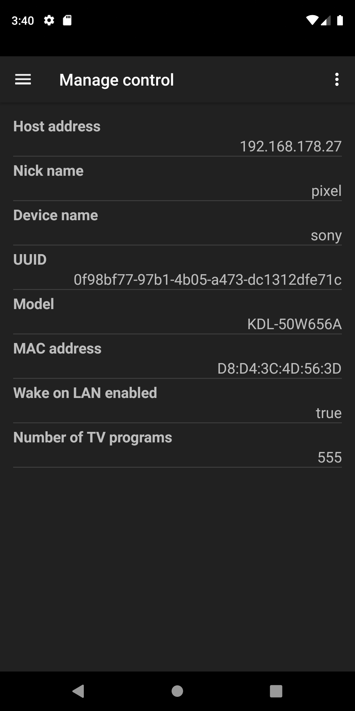
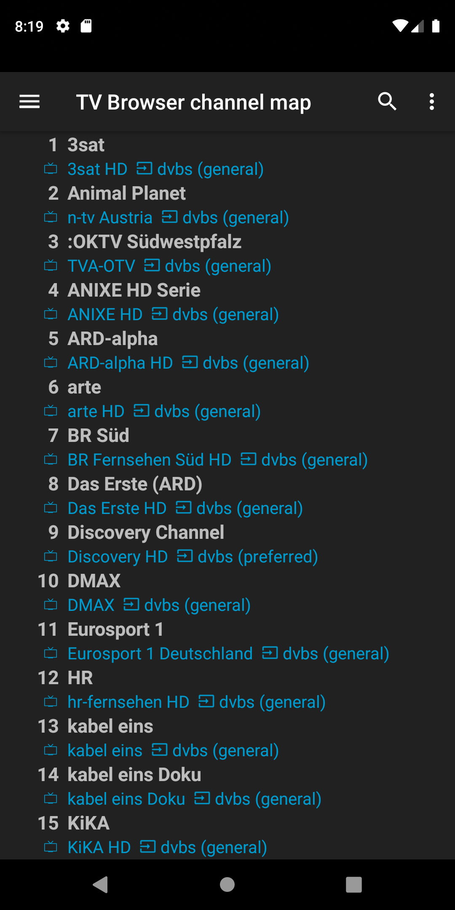
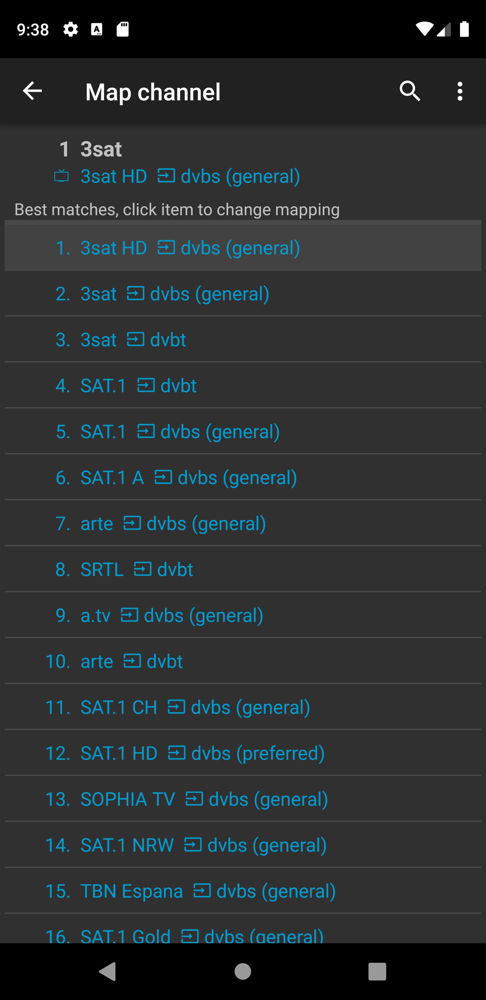
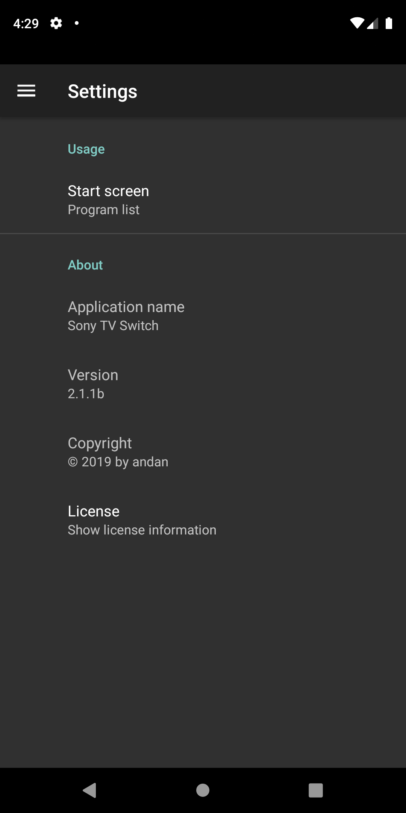

Sony TV Switch
===================================

This app allows the easy control and program switching via network for many Sony TVs. 
It can also be used as plugin for the 
<a href="https:/play.google.com/store/apps/details?id=org.tvbrowser.tvbrowser.play">TV Browser</a> app 
to switch to programs from an electronic program guide (EPG).

#### Key features

- Supports many 'smart' Sony TV models
- Full featured remote control over network
- Power on TV via Wake-on-LAN (WoL)
- Shows program list from TV to easily search for and switch to programs from the app
- Can be set-up for multiple Sony TVs
- As&nbsp;<a href="https://play.google.com/store/apps/details?id=org.tvbrowser.tvbrowser.play">TV Browser</a> plugin: 
Switch to a TV program directly from the program guide (EPG)

## Installation and basic set-up steps

- Install <a href="https://play.google.com/store/apps/details?id=org.andan.android.tvbrowser.sonycontrolplugin">Sony TV Switch app</a>
- Open app
- Add new control from navigation menu
- From 'Manage control' screen menu    
    - Register control at the TV
    - Request program list from TV
- For use as <a href="https://play.google.com/store/apps/details?id=org.tvbrowser.tvbrowser.play">TV Browser</a> plugin
    - Install TV Browser 
    - Open TV Browser
    - Register/enable this app as TV Browser plugin
    - Open plugin settings within TV Browser
    - Map TV Browser channel names to TV programs (mostly automated)
    
## Screens

### Navigation menu

- Select active control from drop-down list in header
- If empty, select 'Add control' item to add control

### Remote control and program switch functions

#### Remote control

- Controls the TV over network like the standard infrared remote control
- The 3-dot menu provides actions for
    - Wake-on-LAN
    - Power saving - screen off
    - Power saving - off

#### TV program list

- List programs (channels) from the TV with additional infos
    - : program source
    - : mapped TV Browser channel name
- Highlighted header item shows current program as received from TV (if available)
    - Click to show further details (see below)
    - Long click to refresh from TV
- Switch to program by clicking on respective list item
- Swap between current and previous program with the action button placed in the bottom right corner
- List can be filtered by using the search action in the app bar
- The 3-dot menu provides actions for
  - Wake-on-LAN
  - Power saving - screen off
  - Power saving - off

##### Details of current program

- Shows details of current program as received from TV

### Manage functions

#### Add control

- Adds new control by providing basic settings
- The nick and device names are used as display names in the remote control settings of your Sony TV
- Host address can be either IP address or host name
- After control is added, the 'Manage control' screen opens to perform further actions

#### Manage control

- Shows details of the control and the controlled TV
- 3-dot menu provides actions to register or delete control, request program list from TV, and enable Wake-on-LAN

##### Register control
- Each control needs to be registered for use with your Sony TV
- Ensure the Sony TV is switched on and accessible via network prior registration
- On first registration, a challenge code will be displayed on the TV screen that needs to entered into the popped-up dialog
- If registration has been successful, the Wake-on-LAN mode of your TV will be enabled to allow power on of the TV via network
- Registration can be performed any time
- In case of any problem, check the settings and any information displayed by the app or on the Sony TV screen

##### Request program list 
- The program list can be requested any time after successful registration
- The number of received programs as shown on the screen might differ from the number shown by the Sony TV as some programs are filtered out (e.g. SAT test programs)

##### Enable Wake-on-LAN
- Enables Wake-on-LAN mode of your TV if supported (will also be enabled during registration)

#### TW Browser channel map

- Manages the mapping between the channel names from the <a href="https://play.google.com/store/apps/details?id=org.tvbrowser.tvbrowser.play">TV-Browser's</a> EPG to 
the corresponding program names as received from the TV
- This mapping is used by the plugin to switch to the corresponding TV program using the channel name from the EPG
- The reason why this mapping is required is that the names are not standardized and that multiple program names might be 
related to a single channel name (e.g. HD and SD programs)
- The channel list is only displayed when the plugin has been activated in 
<a href="https://play.google.com/store/apps/details?id=org.tvbrowser.tvbrowser.play">TV-Browser</a> and the plugin settings have been opened
- The 3-dot menu in the app bar provides actions to match with programs and to clear mapping

##### Match with programs
- Applies a fuzzy based match procedure between the TV Browser channel and the Sony TV program names for the complete (possibly filtered) list
- The mapped program name is displayed after the  mapped TV Browser channel name
- Usually this will provide accurate results for most of the channel items
- If needed, a manual match can be performed by clicking on channel item from the list (see below)

##### Clear all mappings
- Clears all mappings of the list

##### Manual mapping

- Allows the manual mapping between the TV Browser channel and the Sony TV program name
- The mapping is performed by clicking on one of the program items of the list 
- The available list items depend on the the search filter in the app bar
- If no search filter is defined, than the list shows the top 30 matches according to the automatic best match procedure
- Otherwise, the list shows all program names that comply with the search filter

### Settings

- 'Start screen' sets the screen shown on app start and the home screen for navigation within the app.