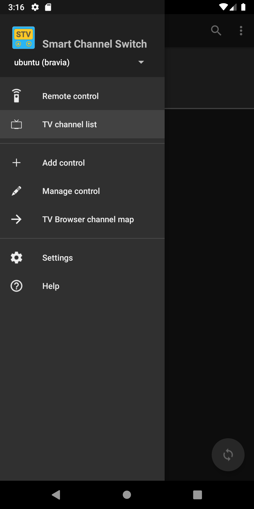
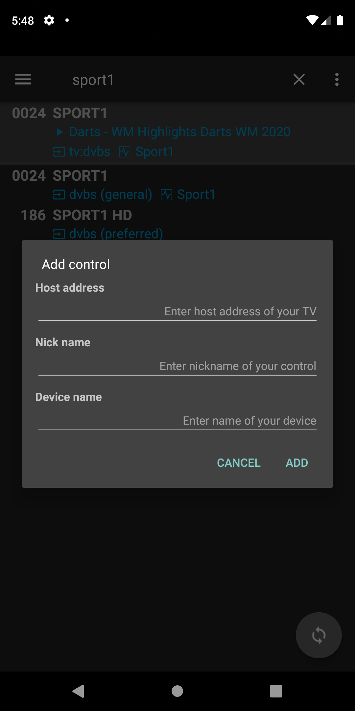
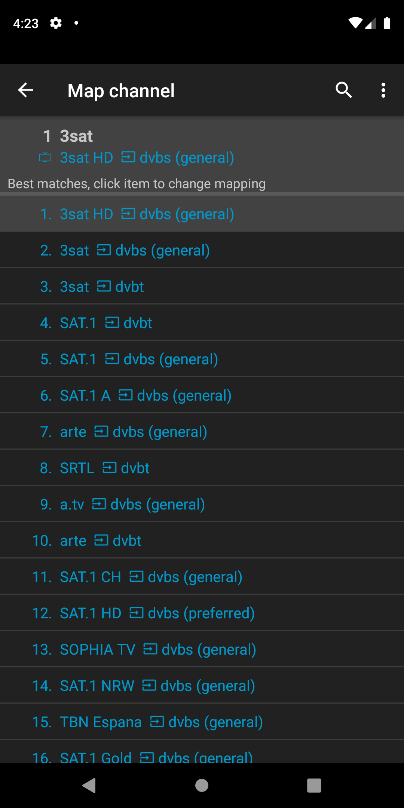

Sony TV Switch
===================================

This app allows the easy control and program switching via network for Sony TVs. 
Furthermore, it can be used a <a href="https://play.google.com/store/apps/details?id=org.tvbrowser.tvbrowser.play">TV Browser</a> plugin.

#### Key features

- Supports many 'smart' Sony TV models
- Full featured remote control over network with Wake-on-LAN (WoL) capability
- Easy searching and switching programs using a program list requested from the TV
- Works with multiple TV devices
- As&nbsp;<a href="https://play.google.com/store/apps/details?id=org.tvbrowser.tvbrowser.play">TV Browser</a> plugin: 
Switch to a TV program directly from the program guide (EPG)

## Installation and basic set-up

- Install <a href="https://play.google.com/store/apps/details?id=org.andan.android.tvbrowser.sonycontrolplugin">Sony TV Switch app</a>
- Open app
- Add new control from navigation menu
- From 'Manage control' screen menu    
    - Register control at the TV
    - Request program list from TV
- For use as <a href="https://play.google.com/store/apps/details?id=org.tvbrowser.tvbrowser.play">TV Browser</a> plugin
    - Open TV Browser
    - Register/enable this app as TV Browser plugin
    - Open plugin settings from TV Browser
    - Map TV Browser channel names to TV programs (mostly automated)
    
More details and guides are stated in the next sections.   
    
## Screens

### Navigation menu

- Select active control from drop-down list in header
- If empty, select 'Add control' item to add control 

### Remote control and program switch functions

#### Remote control

- Controls the TV over network like the standard infrared remote control
- The 3-dot menu offers extra actions for
    - Wake-on-LAN
    - Power saving - screen off
    - Power saving - off

#### TV program list

- List programs (channels) from the TV with additional infos
    -  program source
    -  mapped TV Browser channel name
- Highlighted header item shows current program as received from TV (if available)
    - Click to show further details (see below)
    - Long click to refresh from TV
- Switch program by clicking on respective list item
- Swap between current and previous program with the action button placed in the bottom right corner
- List can be filtered by using the search action in the app bar
- The 3-dot menu offers extra actions for
  - Wake-on-LAN
  - Power saving - screen off
  - Power saving - off

##### Details of current program

- Shows details of current program as received from TV

### Manage functions

#### Add control

- Adds new control by providing basic settings
- The nick and device names are used as display names in the remote control settings of your Sony TV
- Host address can be either address
- After control is added, the 'Manage control' screen opens to perform registration

#### Manage control

- Shows details of the control and the controlled TV
- 3-dot menu provides actions to register or delete control, request program list from TV, and enable Wake-on-LAN

##### Register control
- Each control needs to be registered for use with your Sony TV. The Sony TV has to be switched on for this action
- On first registration, a challenge code that is displayed on the TV screen will have to be entered in the opened dialog
- In case of any problem, check the settings and any information displayed by the app or on the Sony TV screen

##### Request program list 
- The program list can be requested any time after successful registration
- The number of received programs as shown on the screen might differ from the number shown by the Sony TV as some programs are filtered out (e.g. SAT test programs)

##### Enable Wake-on-LAN
- Enables Wake-on-LAN mode of your TV if supported

#### TW Browser channel map

- Manages the mapping between the channel names from the <a href="https://play.google.com/store/apps/details?id=org.tvbrowser.tvbrowser.play">TV-Browser's</a> EPG to 
the corresponding program titles as received from the TV
- This mapping is used by the plugin to switch to the right TV program using the channel name used in the EPG
- The channel list is only displayed when the plugin has been activated in 
<a href="https://play.google.com/store/apps/details?id=org.tvbrowser.tvbrowser.play">TV-Browser</a> and the plugin settings have been opened
- 3-dot menu provides actions to match with programs and to clear mapping

##### Match with programs
- Applies a fuzzy based match procedure between the TV Browser channel and the Sony TV program names for the complete (possibly filtered) list
- The mapped program name is displayed after the  mapped TV Browser channel name
- Usually this will provide accurate results for most of the channel items
- If needed, a manual match can be performed by clicking on channel item from the list (see below)

##### Clear all matches
- Clears all matches

##### Manual mapping

- Allows the manual mapping between the TV Browser channel and the Sony TV program name
- The mapping is performed by clicking on a list item shown below
- The list items depend whether a search filter in the app nar is defined or not
- If no search filter is defined, than the list shows the top 30 matches according to the automatic best match procedure
- Otherwise, the list shows all program names that comply with the search filter

### Settings

- 'Start screen' sets the screen that should be displayed as start (home) screen