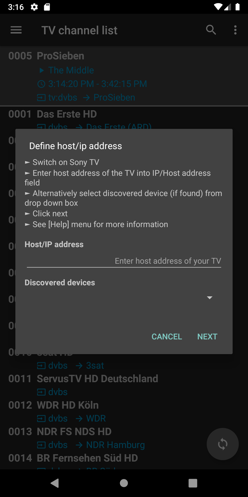
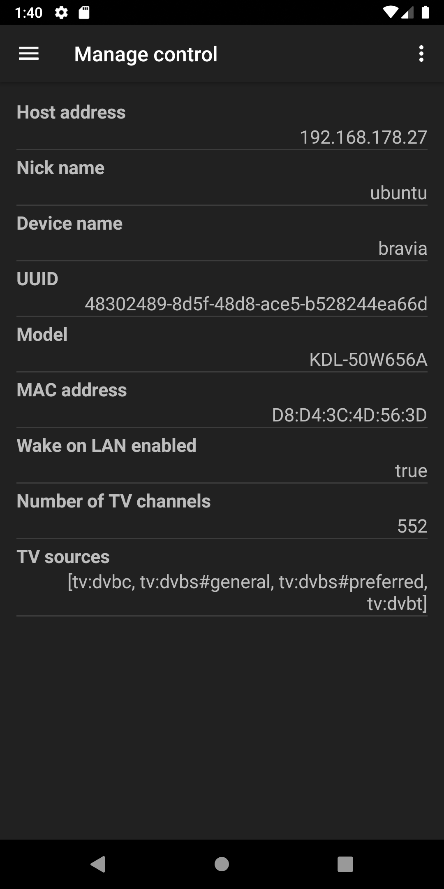
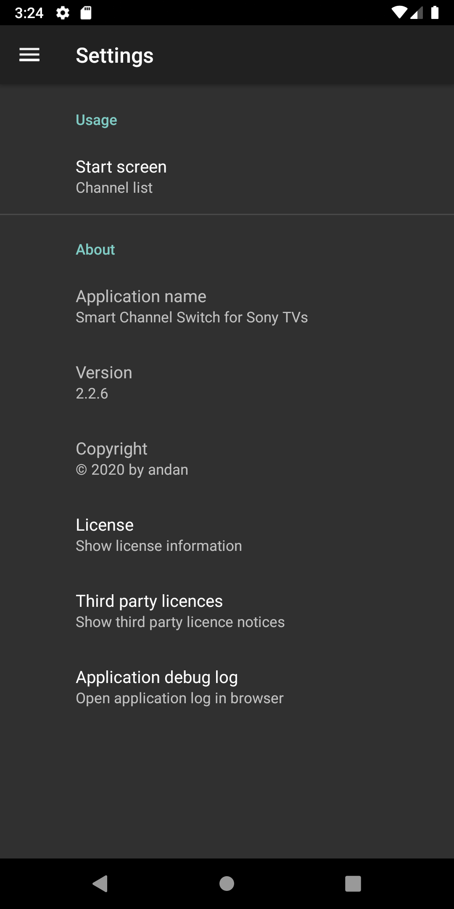

<H1>Smart Channel Switch for Sony TV</H1>

* TOC
{:toc}

## Description

This app enables the browsing through the TV channel list of compatible Sony TVs for an easy channel search and switch.
In addition, it provides a full featured remote control for the TV.
As extra feature tha app can also be used as a plugin for the
It can also be used as plugin for the 
<a href="https:/play.google.com/store/apps/details?id=org.tvbrowser.tvbrowser.play">*TV Browser*</a> app 
to switch to channels from an electronic program guide (EPG).

### Key features

- Supports many 'smart' Sony TV models
- Full featured remote control over network
- Shows channel list from TV to easily search for and switch to channels from the app
- Power on TV via Wake-on-LAN (WoL)
- Can be set-up for multiple Sony TVs
- As&nbsp;<a href="https://play.google.com/store/apps/details?id=org.tvbrowser.tvbrowser.play">*TV Browser*</a> plugin: 
Switch to a TV channel directly from the program guide (EPG)

### TV preparation

- Switch on TV
- Enable remote start on your TV: 
[HOME] → [Settings] → [Network] → [Home Network Setup] → [Remote Start] → [On]
- If applicable set pre-shared key (i.e. arbitrary string XXXX) for your your TV: 
[HOME] → [Settings] → [Network] → [Home Network Setup] → [IP Control] → [Pre-Shared Key] → [XXXX]
- Enable pre-shared key on your TV if menu entry exists: 
[HOME] → [Settings] → [Network] → [Home Network Setup] → [IP Control] → [Authentication] → [Normal and Pre-Shared Key]
- Give your TV a static IP address, or make a DHCP reservation for a specific IP address in your router
- Get/check IP address of your TV: 
[HOME] → [Settings] → [Network] → [Advanced settings] → [IP address]

### Quick installation and set-up guide

- Install <a href="https://play.google.com/store/apps/details?id=org.andan.android.tvbrowser.sonycontrolplugin">*Channel Browser and Remote Control for Sony TV*</a>
- Open app
- Add new control for TV from main menu
- For use as <a href="https://play.google.com/store/apps/details?id=org.tvbrowser.tvbrowser.play">*TV Browser*</a> plugin
    - Install *TV Browser* 
    - Open *TV Browser*
    - Activate this app as *TV Browser* plugin
    - Open plugin settings within *TV Browser*
    - Map *TV Browser* channel to TV channel names (mostly automated)

The following sections provide more detailed descriptions of the set-up steps and other functions.

## Main functions and screens

### Navigation menu
 
- Select active control from drop-down list in header
- If empty, select 'Add control' item to add control

### Use of control functions

#### Remote control
 
- Provides full featured remote control
- The 3-dot menu provides actions for
    - Wake-on-LAN
    - Screen off/on

#### TV channel list
 
- List TV channels with additional information
    - : channel source
    - : mapped *TV Browser* channel name
- Highlighted header item shows selected channel with current program information (if available)
    - Click to show further details (see [below](#details-of-current-program))
    - Long click to refresh program information from TV
- Switch to a TV channel by clicking on respective list item
- Swap between current and previous channel with the action button placed in the bottom right corner
- List can be filtered by using the search action field in the app bar
- The 3-dot menu provides actions for
  - Wake-on-LAN
  - Screen off/on

##### Details of current program

 
- Shows details of current program as received from TV

### Add and manage control functions

#### Add control
Adds and registers a new control in two steps. This is a pre-requisite to use any or the remote control functions of this app.

**1. Define IP/host address**

 
- Enter IP (or host name) of your Sony TV
- Alternatively, select your TV from the 'Discovered devices' drop down box (if listed) to set the IP/host address field
- Click on 'FINISH' will proceed to the next step if the entered or discovered IP/host address is valid (this is checked when button is clicked)
- Otherwise, the dialog is kept open showing an error message

**2. Define Names and pre-shared key (optional)**

 
- Enter (non-empty) nick- and device names that are used as display names
- Enter the pre-shared key if set for your TV
- Click on 'FINISH' to try to register the control on your TV
- If the registration is successful:
    - The dialog will be closed and the 'Manage control' screen will be opened
    - Additional system information and the TV channel list will be fetched from the TV
    - Control is ready for use in the app for all functions
- Otherwise a message will be displayed to indicate the reason of the failure:
    - If no pre-shared key is defined you will be asked to enter a challenge key that is displayed on the TV screen
    - The 'not register anymore' message indicates that the maximum number of registered controls on your TV is reached.
   In this case you have to delete another registered control on your TV first to continue

#### Manage control
 
- Shows details of the control and the controlled TV
- 3-dot menu provides actions to register or delete control, request channel list from TV, and enable Wake-on-LAN

##### Register control
- This re-registers the control on your TV with the existing settings.
- This is normally only required in case of authentication failed errors.

##### Request channel list
- The channel list can be requested any time after successful registration
- The number of received channels as shown on the screen might differ from the number shown by the Sony TV as some channels will be filtered out (e.g. SAT test channels)

##### Enable Wake-on-LAN
- Enables Wake-on-LAN mode of your TV if supported (will also be enabled during registration)

##### Check connectivity
- Opens dialog to check connectivity
- Provides option to change host/ip address of selected control

#### TV Browser channel map

 
- Manages the mapping between the channel names from the <a href="https://play.google.com/store/apps/details?id=org.tvbrowser.tvbrowser.play">TV-Browser's</a> EPG to 
the corresponding channel names as received from the TV
- This mapping is used by the plugin to switch to the corresponding TV channel using the EPG channel name
- The channel list is only displayed when the plugin has been activated in 
<a href="https://play.google.com/store/apps/details?id=org.tvbrowser.tvbrowser.play">*TV-Browser*</a> and the plugin setting screen has been opened
- The 3-dot menu in the app bar provides actions to match with channel names and to clear the mapping

##### Match with channels
- Applies a fuzzy based match procedure between the TV Browser channel and the Sony TV channel names for the complete (possibly filtered) list
- The mapped channel name is displayed after the  mapped *TV Browser* channel name
- Usually this will provide accurate results for most of the channel items
- If needed, a manual match can be performed by clicking on channel item from the list (see [below](#manual-mapping))

##### Clear all mappings
- Clears all mappings of the list

##### Manual mapping
 
- Allows the manual mapping between the *TV Browser* channel and the Sony TV channel name
- The mapping is performed by clicking on one of the channel items of the list
- The available list items depend on the the search filter in the app bar
- If no search filter is defined, than the list shows the top 30 matches according to the automatic best match procedure
- Otherwise, the list shows all channel names that comply with the search filter

### Settings
 
- 'Start screen' sets the screen shown on app start and the home screen for navigation within the app.

## Use as TV Browser plugin

### Open TV Browser's plugin settings
 

- Open 'Plugin settings' from *TV Browser's* main 'Settings'
- If installed, the *Channel Browser and Remote Control for Sony TVs* app should be listed as shown above
- A click on the item will open the plugin settings of the *Channel Browser and Remote Control for Sony TVs* app as shown [below](#open-sony-st-switch-plugin-settings)

### Open Sony TV Switch plugin settings
 
- The app will be activated as plugin by checking the corresponding check box
- 'Open preferences' opens the channel mapping screen as described [above](#tv-browser-channel-map) using the active control

### Switch to Sony TV channel
 
- A **long** click on a channel entry in *TV Browser's* EPG will open a context menu with the option to switch
to the corresponding channel on the Sony TV as defined by the channel mapping

## Troubleshooting

### 'Forbidden error' message
- Re-register control in Manage Control menu as described ([here](#manage-control))

### Channels cannot be switched from TV Browser app
- Stop and and re-open TV Browser app
- Check plugin activation status
- Deactivate/re-activate plugin
- Check active control in *Smart Channel Switch for Sony TV*

