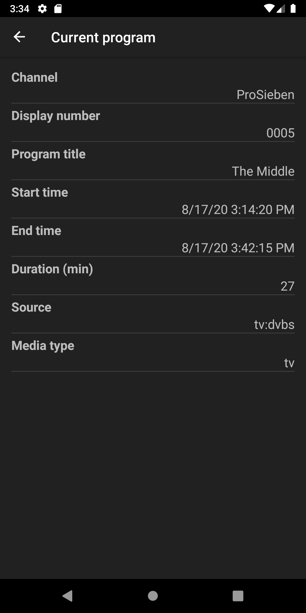

Sony TV Switch
===================================

This app allows the easy control and program switching via network for Sony TVs. 
Furthermore, it can be used a <a href="https://play.google.com/store/apps/details?id=org.tvbrowser.tvbrowser.play">TV Browser</a> plugin.

#### Key features

- Supports many 'smart' Sony TV models
- Full featured remote control over network with Wake-on-LAN (WoL) capability
- Easy searching and switching programs using a program list requested from the TV
- Works with multiple TV devices
- As&nbsp;<a href="https://play.google.com/store/apps/details?id=org.tvbrowser.tvbrowser.play">TV Browser</a> plugin: 
Switch to a TV program directly from the program guide (EPG)

## Installation and basic set-up

- Install <a href="https://play.google.com/store/apps/details?id=org.andan.android.tvbrowser.sonycontrolplugin">Sony TV Switch app</a>
- Open app
- Add new control from navigation menu
- From 'Manage control' screen menu    
    - Register control at the TV
    - Request program list from TV
- For use as <a href="https://play.google.com/store/apps/details?id=org.tvbrowser.tvbrowser.play">TV Browser</a> plugin
    - Open TV Browser
    - Register/enable this app as TV Browser plugin
    - Map TV Browser channel names to TV programs (mostly automated)
    
More details and guides are stated in the next sections.   
    
## Screens

### Navigation menu

- Select active control from drop-down list in header
- If empty, select 'Add control' item to add control 

### Remote control and program switch functions

#### Remote control

{::options parse_block_html="true" /}

{::options parse_block_html="true" /}

- Controls the TV over network like the standard infrared remote control
- The 3-dot menu offers extra actions for
    - Wake-on-LAN
    - Power saving - screen off
    - Power saving - off

{::options parse_block_html="true" /}

#### TV program list

{::options parse_block_html="true" /}

{::options parse_block_html="true" /}

- List programs (channels) from the TV with additional infos
    -  program source
    -  mapped TV Browser channel name
- Highlighted header item shows current program as received from TV (if available)
    - Click to show further details (see below)
    - Long click to refresh from TV
- Switch program by clicking on respective list item
- Swap between current and previous program with the action button placed in the bottom right corner
- List can be filtered by using the search action in the app bar
- The 3-dot menu offers extra actions for
  - Wake-on-LAN
  - Power saving - screen off
  - Power saving - off

{::options parse_block_html="true" /}

##### Details of current program

{::options parse_block_html="true" /}

{::options parse_block_html="true" /}

- Shows details of current program as received from TV

{::options parse_block_html="true" /}

### Management functions

#### Add control

{::options parse_block_html="true" /}

{::options parse_block_html="true" /}

- Adds new control by providing basic settings
- The nick and device names are used as display names in the remote control settings of your Sony TV
- Host address can be either address
- After control is added, the 'Manage control' screen opens to perform registration

{::options parse_block_html="true" /}

#### Manage control
{::options parse_block_html="true" /}

{::options parse_block_html="true" /}

- Shows details of the control and the controlled TV
- 3-dot menu provides actions to register or delete control and to request program list from TV
- Each control needs to be registered for use with your Sony TV. The Sony TV has to be switched on for this action
- On first registration, a challenge code that is displayed on the TV screen will have to be entered in the opened dialog
- In case of any problem, check the settings and any information displayed by the app or on the Sony TV screen
- The program list can be requested any time after successful registration. The number of received programs as shown on the screen might 
differ from the number shown by the Sony TV as some programs are filtered out (e.g. SAT test programs)
- If needed and possible, turn on Wake-on-LAN 

{::options parse_block_html="true" /}

